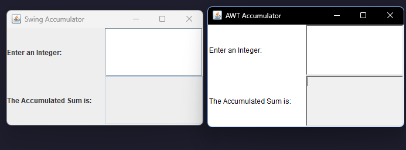

- Create an ArrayList of Media, then add some media (CD, DVD or Book) into the list.
- Iterate through the list and print out the information of the media by using toString() method.
  Observe what happens and explain in detail.
### Code:
```java
    package hust.soict.itep.aims.media;
    import java.util.ArrayList;
    
    public class MediaTest {
        public static void main(String[] args) {
           
            ArrayList<Media> medias = new ArrayList<>();
            
            CompactDisc cd = new CompactDisc("Hello World", "RoboMan");
            DigitalVideoDisc dvd = new DigitalVideoDisc("The Lion King", "Animation", "Roger Allers",4, 28.15f);
            Book book = new Book("The Call of Cthulhu", "Horror", 6.3f);
    
            medias.add(cd);
            medias.add(dvd);
            medias.add(book);
            
            for(Media m : medias){
                System.out.println(m.toString());
            }
        }
    }

```
### Output: 
```
hust.soict.itep.aims.media.CompactDisc@723279cf
DVD - [The Lion King] - [Animation] - [Roger Allers] - [4] : [28.15]$
hust.soict.itep.aims.media.Book@70177ecd
```
## Giải thích: 
default implementation cho toString() của Object class:

- Do ta chưa override method toString() của class Book và CompactDisc, java sẽ tự lấy default implementation của Object class
Vd: hust.soict.itep.aims.media.Book@70177ecd
  - getClass().getName()-> hust.soict.itep.aims.media.Book
  - @ -> @
  - Integer.toHexString(hashCode())->70177ecd

# Reading Assignment: Please answer three questions below:
## What are the advantages of Polymorphism?
### Tái sử dụng - Code Reusability: 
  - Tính đa hình (polymorphism) cho phép cùng một phương thức hoặc lớp được sử dụng với nhiều kiểu đối tượng khác nhau, từ đó giúp mã nguồn được tái sử dụng hiệu quả hơn.
### Linh hoạt - Flexibility: 
  - Các đối tượng thuộc những lớp khác nhau được xử lý như các đối tượng của cùng một lớp cha
-> mang lại sự linh hoạt trong việc thực thi phương thức và tương tác giữa các đối tượng.
### Trừu tượng hóa - Abstraction: 
 - Đơn giản hóa quá trình tương tác với đối tượng bằng cách cho phép sử dụng các lớp trừu tượng hoặc giao diện (interface), giúp bạn làm việc với các kiểu tổng quát (như lớp cha hoặc interface) thay vì các kiểu cụ thể (như lớp con)

### Tính động - Dynamic Behavior: 
  - Java có thể xác định phương thức phù hợp để gọi tại runtime, tạo nên hành vi động cho chương trình dựa trên kiểu thực tế của đối tượng thay vì kiểu tham chiếu. 


## How is Inheritance useful to achieve Polymorphism in Java?

- Inheritance giúp một lớp con thừa kế các phương thức và tính chất của superclass(lớp cha) tạo ra điều kiện cho sự đa hình : một tham chiếu kiểu lớp cha có thể trỏ đến các đối tượng thuộc các lớp con
## What are the differences between Polymorphism and Inheritance in Java?

| **Inheritance**                                                | **Polymorphism**                                                                          |
|----------------------------------------------------------------|-------------------------------------------------------------------------------------------|
| Cho phép một lớp kế thừa thuộc tính và phương thức từ lớp khác. | Cho phép một phương thức có nhiều cách hoạt động khác nhau tùy theo đối tượng sử dụng nó. |
| Dùng để tái sử dụng mã từ lớp cha.                             | Dùng để viết mã linh hoạt hơn khi làm việc với các đối tượng khác nhau.                   |
| Áp dụng cho class                                              | Áp dụng cho method.                                                                       |
| Có thể có nhiều kiểu kế thừa như đơn, đa cấp, phân cấp, v.v.   | Có hai loại chính: compile-time và run-time.                                              |
| VD:Lớp `XeMay` kế thừa từ lớp `PhuongTien`.                    | VD: Phương thức `play()` hoạt động khác nhau với `CD`, `DVD`, hay `DigitalVideoDisc`.     |

