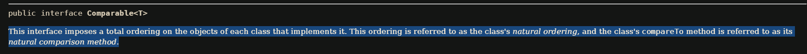

Question: Alternatively, to compare items in the cart, instead of using the Comparator class I have
mentioned, you can use the Comparable interface1 and override the compareTo()method. You can
refer to the Java docs to see the information of this interface.
Suppose we are taking this Comparable interface approach.
- What class should implement the Comparable interface?
  - Any base class that we want to sort by default. In this case i would pick the Media class:
  ```java
    public class Media implements Comparable<Media>{}
  ```
- In those classes, how should you implement the compareTo()method to reflect the ordering that
  we want?
  **Sort tiles by alphabetical ordering first and then by descending cost** 

  ```java
  @Override
  public int compareTo(Media m2) {
    int titleCompare = this.title.compareTo(m2.title);
    if (titleCompare != 0) {
        // if the two medias are not equal 
      return titleCompare;
    }
    return Double.compare(m2.cost, this.cost);
  }
  ```
  **Or Sort by descending cost first and then titles by alphabetical order**

  ```java
  @Override
  public int compareTo(Media m2) {
    
    int costCompare = Double.compare(m2.cost, this.cost);
    if(costCompare != 0){
        return costCompare;
    }
    return this.title.compareTo(m2.title);
  }
  ```

- Can we have two ordering rules of the item (by title then cost and by cost then title) if we use this Comparable interface approach?
  - 
  
  - We can't have two ordering rules of the item because When a class implements Comparable<T>, it establishes a single default method of comparing its instances, known as the class's natural ordering. This ordering is determined by the implementation of the compareTo() method within the class.


- Suppose the DVDs have a different ordering rule from the other media types, that is by title, then
  decreasing length, then cost. How would you modify your code to allow this?
```java
  public class DVD extends Item {
      @Override
      public int compareTo(Item dvd2) {
        // alphabet tiles, length asc, cost desc
        int titleCompare = this.title.compareTo(dvd2.title);
        if (titleCompare != 0) {
          // if the two medias are not equal 
          return titleCompare;
        }
        int lengthCompare = Integer.compare(this.length, dvd2.length); 
        if(lengthCompare != 0){
            return lengthCompare;
        }
        return Double.compare(dvd2.cost, this.cost);

      }
  }

```