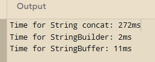

# So sánh String, StringBuilder and StringBuffer
## Report thời gian chạy 
The output of the file OtherProjects/src/ConcatenationInLoops.java

## Đánh giá 
- Ta thấy từ kết quả trên StringBuilder là cách để concat strings nhanh nhất

- Một số kết luận đối với bài https://redfin.engineering/java-string-concatenation-which-way-is-best-8f590a7d22a8

    - Sử dụng String khi cho các hằng số hoặc dữ liệu không thay đổi, tốc độ rất chậm.

    - Sử dụng StringBuilder khi bạn cần thao tác chuỗi nhiều lần trong môi trường đơn luồng, tốc độ nhanh nhất trong cả ba.

    - Sử dụng StringBuffer khi bạn cần thao tác chuỗi trong môi trường đa luồng, nơi an toàn luồng là cần thiết. Chậm hơn StringBuilder nhưng đảm bảo tính nhất quán khi nhiều luồng truy cập.

